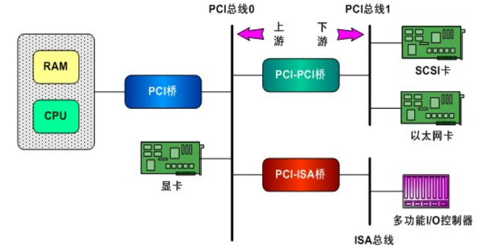

# PCI

## PCI总线简介

PCI(外部设备互联)总线是有Intel推出的一种局部总线，作为一种通用的总线接口标准



- PCI Host Bridge（PCI桥）：PCI Host Bridge是PCI总线的起始点，它连接主机系统的CPU和内存与PCI总线之间的桥接器。PCI主机桥负责管理和控制PCI总线，并提供对PCI设备的访问和配置功能。

- PCI Bridge（PCI桥接器）：PCI Bridge用于连接不同的PCI总线段，扩展PCI总线的拓扑结构。它可以将一个PCI总线分为多个独立的PCI总线段，或者将多个PCI总线合并为一个更大的PCI总线。PCI桥接器负责在不同的PCI总线之间进行数据传输和转发，并提供总线之间的地址和数据转换。例如图中的PCI-to-ISA桥、PCI-to-Cardbus桥。

- PCI Device（PCI设备）：PCI设备是连接到PCI总线上的外部设备或插件卡。它们可以是各种类型的硬件设备，如网卡、显卡、声卡、存储控制器等。每个PCI设备都有一个唯一的设备ID和厂商ID，用于识别设备和与设备进行通信。PCI设备通过PCI总线进行配置和控制，并通过读取和写入PCI配置空间中的寄存器来提供设备的功能和性能。

## Linux PCI设备驱动

> Linux PCI设备驱动包括Linux PCI设备驱动和设备本身的驱动两部分。其中，Linux PCI设备驱动是Linux内核实现的，不需要我们实现，我们需要实现的是设备本身的驱动。

### 关键结构体
> include/linux/pci.h
#### pci_driver：PCI设备驱动程序
```c
struct pci_driver {
    struct list_head node;          // 用于将驱动程序添加到PCI驱动列表
    const char *name;               // 驱动程序的名称
    const struct pci_device_id *id_table;  // PCI设备ID表，用于匹配支持的设备
    int (*probe)(struct pci_dev *dev, const struct pci_device_id *id);   // 设备探测函数
    void (*remove)(struct pci_dev *dev);    // 设备移除函数
    void (*shutdown)(struct pci_dev *dev);  // 设备关闭函数
    ...
    struct pci_error_handlers *err_handler; // 错误处理器
    struct device_driver driver;     // 内核设备驱动结构体
    ...
};
```

#### pci_dev：PCI设备结构体
> 详细描述了一个PCI设备几乎所有的硬件信息
```c
struct pci_dev {
    struct list_head bus_list;       // 用于将设备添加到所在总线的设备列表
    struct pci_bus *bus;             // 指向设备所在的PCI总线
    struct pci_bus *subordinate;     // 指向该设备的子总线
    struct pci_dev *next;            // 指向同一总线上的下一个设备
    struct pci_dev *previous;        // 指向同一总线上的前一个设备
    struct device dev;               // 内核设备结构体，用于通用设备管理
    ...
};
```
#### PCI设备驱程序框架

```c
#include <linux/module.h>
#include <linux/pci.h>

struct pci_card
{
};

static struct pci_device_id ids[] = {
    {PCI_DEVICE(0x1234, 0x5678)}, // 替换为实际的设备ID和厂商ID
    {
        0,
    } // 最后一组是0，表示结束
};

MODULE_DEVICE_TABLE(pci, ids);

/* 设备中断服务*/
static irqreturn_t demp_interrupt(int irq, void *dev_id)
{
}

static struct file_operations demo_fops = {
    .owner = THIS_MODULE,
    .open = demo_open,
    .release = demo_release,
    .read = demo_read,
    .write = demo_write,
};

// 设备探测函数
static int demo_pci_probe(struct pci_dev *pdev, const struct pci_device_id *id)
{
    // 进行设备初始化和配置
    // 可以进行资源分配、中断注册、设备启动等操作
    return 0; // 返回0表示设备探测成功
}

// 设备移除函数
static void demo_pci_remove(struct pci_dev *pdev)
{
    // 进行设备清理和资源释放
    // 可以注销中断、释放资源等操作
}
static struct pci_driver demo_pci_driver = {
    .name = "dmeo_pci",
    .id_table = ids,
    .probe = demo_pci_probe,
    .remove = demo_pci_remove,
};

static int __init pci_skel_init(void)
{

    return pci_register_driver(&demo_pci_driver);
}

static void __exit pci_skel_exit(void)
{

    pci_unregister_driver(&demo_pci_driver);
}
module_init(pci_skel_init);
module_exit(pci_skel_exit);

MODULE_LICENSE("GPL");

```