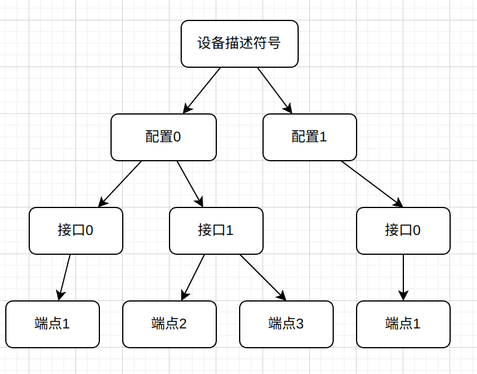

# USB

Linux USB分为主机控制器(Host Controller)和USB设备控制器(UDC)。所有的USB传输，都是从USB主机这方发起的；USB设备没有"主动"通知USB主机的能力。

## 设备、配置、借口和端点

在USB设备的逻辑组织中，包含设备、配置、借口和端点4个层次。

- 一个USB设备描述符中可以有多个配置描述符，即USB设备可以有多种配置，不同的配置使设备表现出不同的功能组合（在探测/连接期间需从中选择一个）
- 一个配置描述符中可以有多个接口描述符，即USB设备可以支持多种功能（接口）
- 一个接口描述符中可以有多个端点描述符，一个接口代表一个基本的功能
- 一个配置中的所有接口可以同时有效，并可被不同的驱动程序连接
- 端点是设备与主机之间进行数据传输的逻辑接口，每个端点都有唯一的地址。端点描述符描述了数据的传输类型、传输方向、数据包大小和端点号（也可称为端点地址）等。
- 除了描述符中描述的端点外，每个设备必须要有一个默认的控制型端点，地址为0，它的数据传输为双向，而且没有专门的描述符，只是在设备描述符中定义了它的最大包长度。端点0用于设备初始化，只要设备连接到USB上并且上电，端点0就可以被访问。主机可以通过此端点向设备发送命令，获得设备的各种描述符的信息，并通过它来配置设备。而其他的端点一般作为数据端点，并且都是单向的。

上面这些结构体都可以在[ch9.h](./kernel_usb/ch9.h)中找到，这个文件位于`linux/include/uapi/linux/usb/`中找到

层次示意图如下：



## 主机控制器驱动(HCD)

### usb_hcd结构体

具体见[hub.h](./kernel_usb/hcd.h)


其中的 *driver 成员指向主机控制器的函数

hc_driver结构体也在hub.h中,其中包含了`urb_enqueue()`函数指针，这个函数用于将URB(USB Request Block)请求添加到USB核心层的传输队列中。

具体的主机驱动实现可以在`linux/drivers/usb`查看，例如在`host`中有EHCI HCD驱动的实现，在`chipidea`中有Chipidea USB驱动的实现。

## USB设备驱动

### 重要结构体

这些结构体都可以在[usb.h](./kernel_usb/linux-usb.h)中找到，这个文件位于`linux/include/linux/usb.h`

#### usb_driver

`usb_driver`结构体用于描述USB设备驱动，其中的`probe()`函数用于在USB设备插入时调用，`disconnect()`函数用于在USB设备拔出时调用。

#### usb_device

`usb_device`结构体用于描述USB设备，其中的`dev.bus`成员指向了USB总线，`dev.driver`成员指向了USB设备驱动。


### USB请求块

USB请求块（USB Request Block，URB）是USB设备驱动中用来描述USB数据传输请求和相关参数的结构体。

urb结构体定义在linux/include/linux/[usb.h](./kernel_usb/linux-usb.h)中，1420行。

USB设备中的每个端点都处理一个URB队列，URB的处理流程如下：

1. 被一个USB设备驱动创建
    ```c
    struct urb *usb_alloc_urb(int iso_packets, gfp_t mem_flags);
    ```
    - 参数说明：
      - iso_packets：用于表示 URB 中的 ISO(等时数据) 包数量，对于非 ISO 传输，该值应为 0
      - mem_flags：表示内存分配的策略，同kmalloc()
    - 使用`usb_free_urb()`释放
    - URB在驱动中不建议静态创建（直接定义一个URB变量--`struct urb a;`），因为可能破坏USB核心给URB使用的引用计数方法，建议使用上面函数动态创建

2. 初始化，被安排给一个特定的USB设备的特定端点
    
    根据传输类型，需要调用不同的初始化函数
    ```c
    // 控制
    static inline void usb_fill_control_urb(struct urb *urb,
                        struct usb_device *dev,
                        unsigned int pipe,
                        unsigned char *setup_packet,
                        void *transfer_buffer,
                        int buffer_length,
                        usb_complete_t complete_fn,
                        void *context)
    // 中断，参数同上
    static inline void usb_fill_int_urb()
    // 批量，参数同上
    static inline void usb_fill_bulk_urb()
    ```
    - 参数说明:
      - urb: 要初始化的URB
      - dev：指向这个URB被发送到的USB设备
      - pipe：特定端点
        - 使用`usb_sndbulkpipe()`或`usb_rcvbulkpipe()`创建，两个函数的参数都是`(struct usb_device *dev, unsigned int endpoint)`，endpoint是端点地址，两个函数区别在于数据传输的方向。
      - setup_packet：指向被发送到端点的设置数据包，用于设置控制传输所需的控制请求数据
      - transfer_buffer：传输数据缓冲区
      - buffer_length：传输数据缓冲区大小
      - complete_fn：传输完成后的回调函数
      - context：处理函数的上下文数据
    - 对于等时URB（用于传输实时数据，用于音频，视频等），没有专门的初始化函数，而是手动初始化，可以参考`linux/drivers/media/usb/uvc/usc_video.c`中1501行的实现。

3. 提交给USB核心层处理
    ```c
    int usb_submit_urb(struct urb *urb, gfp_t mem_flags);
    ```

4. 当URB完成时，USB核心层会调用URB的回调函数，即上面指定的`complete()`函数
    - 在回调函数中，需要检测`urb->status`来判断URB是否发生错误
    - status 等于0表示成功，其他值表示错误或被杀死

对于已提交的URB，可以使用`usb_unlink_urb()`或`usb_kill_urb()`来取消，前者用于取消正在进行的URB，但不保证立即停止传输;后者会立即停止传输并释放资源。


对于一些只需要与USB设备进行的接受或发送一些简单的数据的驱动程序，没必要进行上面完整的URB流程，可以使用下面两个简单的函数。这两个函数都是同步的，所以不能应用在中断上下文和持有自旋锁的情况。

```c
// 批量
int usb_bulk_msg(struct usb_device *dev, 
                 unsigned int pipe,
                 void *data, int len, int *actual_length, 
                 int timeout);
```
- actual_length: 指向整数的指针，用于返回实际传输的字节数。
- 成功返回0,否则返回负的错误值
```c
// 控制
int usb_control_msg(struct usb_device *dev, 
                    unsigned int pipe, __u8 request, 
                    __u8 requesttype, __u16 value, 
                    __u16 index, void *data, __u16 size, 
                    int timeout);
```
- requesttype：控制请求类型。
- value：这个控制消息的USB消息值
- index：这个控制消息的USB消息索引值
- 成功返回实际传输的字节数，否则返回负的错误值


## USB骨架程序

Linux内核源码中的 driver/usb/[usb-skeleton.c](./read_code/usb-skeleton.c)提供了一个最基础的USB驱动程序，可以参考这个程序来编写自己的USB驱动程序。


## USB UDC和Gadget驱动

> 这里只是简单介绍概念

USB设备控制器（UDC）驱动指的是作为其他USB主机控制器外设的USB硬件设备上底层硬件控制器的驱动，该硬件和驱动负责将一个USB设备依附于一个USB主机控制器上。例如，当某运行Linux系统的手机作为PC的U盘时，手机中的底层USB控制器行使USB设备控制器的功能，这时运行在底层的是UDC驱动，手机要成为U盘，在UDC驱动之上需要另外一个驱动，对于USB大容量存储器而言，这个驱动为File Storage驱动，称为Function驱动。

Gadget 驱动是用于实现 USB 设备功能的软件驱动程序。Gadget 驱动运行在具有 USB UDC 支持的设备上，通过与 UDC 通信来模拟或实现 USB 设备的各种功能。Gadget 驱动可以实现各种类型的 USB 设备功能，例如存储设备、网络接口、音频设备、人机接口设备等。Gadget 驱动与具体的设备功能密切相关，它负责处理 USB 协议、配置描述符、设备状态、数据传输和与主机的通信。
