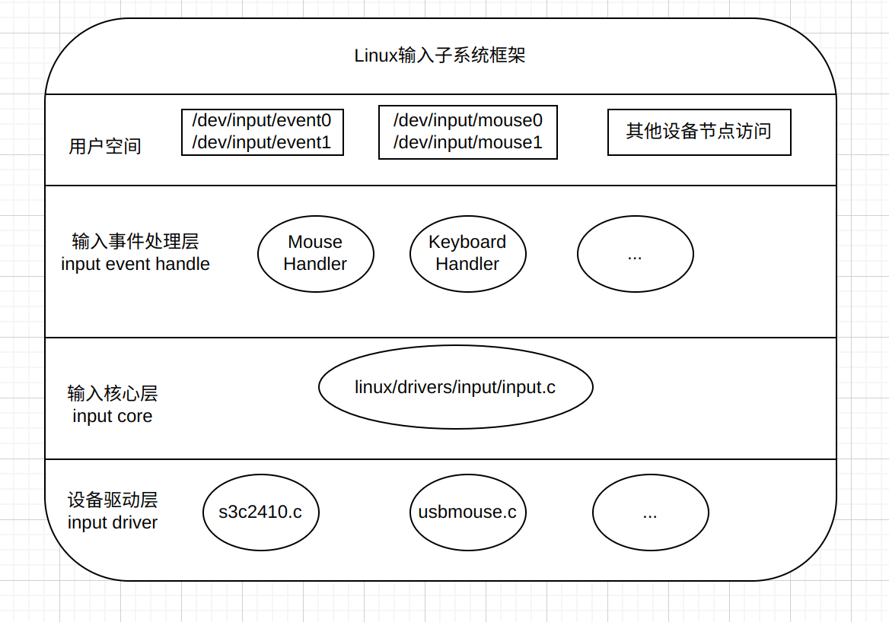
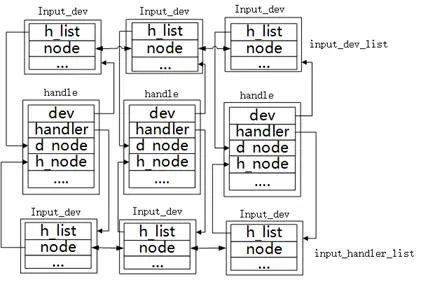
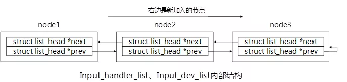

# Linux input

## Linux输入子系统框架



Linux输入子系统由驱动层、核心层、事件处理层三部分组成。
- 驱动层：输入设备的具体驱动程序，负责与具体的硬件设备进行交互，并将底层的硬件输入转化为统一的事件形式，向核心层发送
- 核心层：连接驱动层和事件处理层，负责对下层提供驱动层借口，向上层提供事件处理接口
- 事件处理层：负责对输入事件进行处理，并将处理结果传递给应用程序
- 层的设备抽象出对应的接口提供给应用层。将底层设备的触发的事件通过这个接口传达给应用层。

核心层的代码在 linux/drivers/input/[input.c](./kernel_input/input.c) 中实现


### 重要结构体

#### input_dev

这个结构体属于驱动层，描述了一个具体的input设备，记录相关的硬件信息，事件位图等，

```c
struct input_dev {
	const char *name;       // 设备名称
	struct input_id id;     // 设备id，存储输入设备的总线、厂商等信息
    ...
    unsigned long evbit[BITS_TO_LONGS(EV_CNT)];     // 支持事件类型
	unsigned long keybit[BITS_TO_LONGS(KEY_CNT)];   // 按键位图
	unsigned long relbit[BITS_TO_LONGS(REL_CNT)];   // 相对位移位图
    ...
    struct list_head	h_list;     // 内核链表头
	struct list_head	node;       // 内核链表节点
};
```
Linux设备支持的事件类型:

| 事件类型 | 编码 | 事件描述 |
| -- | -- | -- |
| EV_SYN |0x00 | 同步事件 |
| EV_KEY |0x01 | 按键事件（鼠标，键盘等）| 
| EV_REL |0x02 | 相对坐标(如：鼠标移动，报告相对最后一次位置的偏移) |
| EV_ABS |0x03 | 绝对坐标(如：触摸屏或操作杆，报告绝对的坐标位置) |
| EV_MSC |0x04 | 其它 |
| EV_SW	 |x05 | 开关 |
| EV_LED |0x11 | 按键/设备灯 |
| EV_SND |0x12 | 声音/警报 |
| EV_REP |0x14 | 重复 |
| EV_FF	 |x15 | 力反馈 |
| EV_PWR |0x16 | 电源
| EV_FF_STATUS |0x17 | 力反馈状态 |
| EV_MAX |0x1f | 事件类型最大个数和提供位掩码支持 |


#### input_handler

这个结构体属于事件处理层，描述一个事件处理器

```c
struct input_handler {

	void *private;
    // 事件处理函数
	void (*event)(struct input_handle *handle, unsigned int type, unsigned int code, int value);
	void (*events)(struct input_handle *handle,
		       const struct input_value *vals, unsigned int count);
	bool (*filter)(struct input_handle *handle, unsigned int type, unsigned int code, int value);
    
    // 设备匹配函数
	bool (*match)(struct input_handler *handler, struct input_dev *dev);

    // 设备连接函数，匹配成功后连接
	int (*connect)(struct input_handler *handler, struct input_dev *dev, const struct input_device_id *id);
	void (*disconnect)(struct input_handle *handle);
	void (*start)(struct input_handle *handle);

	bool legacy_minors;
	int minor;
	const char *name;

    // 设备支持列表
	const struct input_device_id *id_table;

	struct list_head	h_list;
	struct list_head	node;
};
```
#### input_handle

这个结构体属于核心层，描述一个配对的input设备和input设备处理器

```c
struct input_handle {

	void *private;
    
	int open;               // 打开标志
	const char *name;       // 名称

	struct input_dev *dev;
	struct input_handler *handler;

	struct list_head	d_node;
	struct list_head	h_node;
};
```

#### input_handle_list

```c
struct input_handle_list {
	struct list_head	list;
	struct input_handle	*first;
	struct input_handle	*last;
};
```

#### 两条重要链表

在 input.c 中，全局维护了两条重要的链表，分别是输入设备链表和事件处理器链表
```c
static LIST_HEAD(input_dev_list);
static LIST_HEAD(input_handler_list);
```

#### 总结

上面结构体的链表的关系如下面两图所示（这个图好难画-.-，就在网上找了一个,[原文连接](https://www.51cto.com/article/680032.html)）






当我们使用`input_register_device()`注册一个设备的时候，就会将设备添加到`input_dev_list`链表中，同时便利`input_handler_list`进行匹配，匹配成功就会调用`input_handler->connect()`函数进行连接


### 事件相关结构体


#### input_event

事件的输入就是以一个input_event为基本单位的
```c
struct input_event {
	struct timeval time;  /* 事件发生的时间 */
	__u16 type;           /* 事件总类型 */
	__u16 code;           /* 事件子类型 */
	__s32 value;          /* 事件的值 */
};
```

#### evdev_client

```c
struct evdev_client {
	unsigned int head;
	unsigned int tail;
	unsigned int packet_head; /* [future] position of the first element of next packet */
	spinlock_t buffer_lock; /* protects access to buffer, head and tail */
	struct fasync_struct *fasync;
	struct evdev *evdev;
	struct list_head node;
	int clk_type;
	bool revoked;
	unsigned int bufsize;
	struct input_event buffer[];
};
```
- head：表示客户端缓冲区中下一个要读取的事件的索引。当客户端从缓冲区读取事件时，它会从 buffer[head] 开始读取，并递增 head 的值。因此，head 指向的是最老的未读取事件的位置。
- tail：表示客户端缓冲区中下一个要写入的事件的索引。当输入事件到达并需要被缓冲时，它将被写入到 buffer[tail] 的位置，并递增 tail 的值。因此，tail 指向的是最新的未写入事件的位置。

实际上，evdev_client 实现了一个环形队列，head是头指针，tail是尾指针，这两个指针都是以 input_event 为单位移动的。

packet_head 与 head 和 tail 不同, 它以数据包（多个input_event）为单位，主要负责记录缓冲区的入口偏移量。

buffer 就是循环队列数组，即缓冲区

所以，根据这些变量我们可以知道，当循环队列满的时候，`head = tail`；当循环队列空的时候，`packet_head = tail`。

#### evdev

```c
struct evdev {
	int open;   // 设备打开计数
	struct input_handle handle; 
	wait_queue_head_t wait;     // 等待队列，没有事件时进程睡眠
	struct evdev_client __rcu *grab;    // 事件响应

    // 客户端链表，可以有多个进程访问设备
	struct list_head client_list;
	spinlock_t client_lock; /* protects client_list */
	struct mutex mutex;
	struct device dev;
	struct cdev cdev;
	bool exist;
};
```

#### 总结

- input_event: 表示一个输入事件
- evdev_client: 表示一个用户空间的应用程序或实体设备与输入设备之间的连接
- evdev: 输入设备驱动程序的接口实现，应用程序可以通过evdev与evdev_client之间的交互，实现输入事件的读取和输入


## 流程

> 这部分建议阅读源码

在输入设备驱动（input_dev）中，一般通过轮询或者中断方式获取事件的原始值，经过一些处理后，通过`input_event()`函数将数据上报给核心层（input_core）。

在核心层中，通过`input_handle_event()`和`input_pass_values()`对数据进行处理（type、code、value），然后使用`input_to_handler()`函数将数据上报给事件处理层（input_handler），在`input_to_handler()`中，使用`input_handler`结构体中的事件处理函数（event、events、filter）上报，这些函数可以在`evdev.c`的1235行的`evdev_handler`中找到。

在事件处理层中，通过`evdev_events()`和`evdev_pass_values()`为事件加上时间戳，完成了一个完整的`input_event`，然后使用`__pass_event()`将事件传递给用户空间（evdev_client的buffer中）

在`__pass_event()`中，事件`input_event`会被填充到`evdev_client`的`buffer`中。对于用于空间的应用程序，可以通过`read()`函数调用内核空间的`evdev_read()`函数，然后调用`evdev_fetch_next_event()`函数从环形缓冲区中读取`input_event事件`
